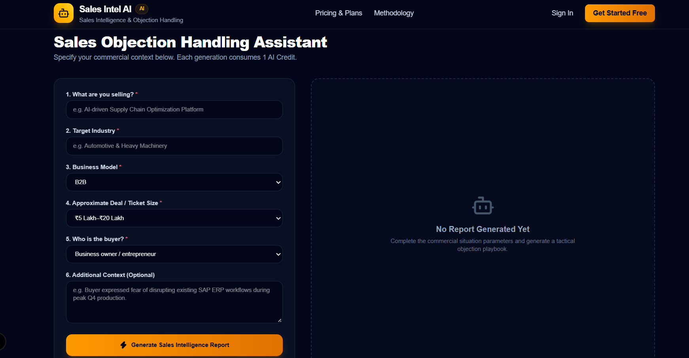
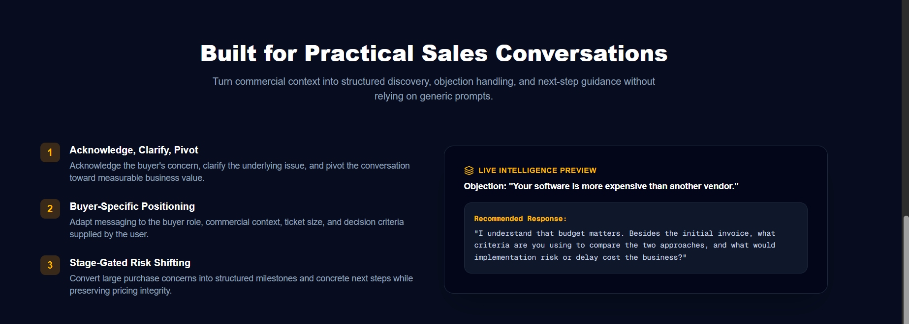

# Sales Intel AI

**AI-powered Sales Objection Handling Assistant and Sales Intelligence SaaS**

Sales Intel AI helps sales teams analyze high-value commercial situations and generate practical objection-handling guidance, discovery questions, root-cause analysis, and value-positioning strategies.

The application combines structured sales inputs, transcript-based RAG, Google Gemini, credit-based usage, subscription billing, and an administrative console into one SaaS platform.

## Features

- **Sales Intelligence Reports** - Generate structured guidance from product, industry, business model, deal size, buyer type, and additional context.
- **Objection Handling** - Generate practical responses, discovery questions, root-cause analysis, and value-positioning guidance.
- **Transcript-based RAG** - Ground AI responses using approved sales-methodology video transcripts.
- **Credit-based usage** - AI generations consume credits from a server-side credit ledger.
- **Four access models**
  - Always Free
  - Free 1-Month Trial
  - Monthly Subscription
  - One-Time Purchase
- **Razorpay payments** - Supports one-time checkout and recurring monthly subscriptions with server-side signature and webhook verification.
- **Authentication and authorization** - JWT-based authentication with role-aware admin access.
- **Admin Console** - Manage users, credits, plans, transcripts, and audit logs.
- **Security controls** - Server-side entitlement checks, input validation, rate limiting, audit logging, idempotency, and prompt-injection defenses.
- **Responsive UI** - Designed for desktop and mobile workflows.

## Screenshots

### Landing Page


### Sales Objection Handling Assistant



### Pricing and Plans


### Methodology / RAG Experience



## SaaS Plans

| Plan | Type | Access | Credits | Renewal |
|---|---|---|---:|---|
| Always Free | Free | Ongoing | 5 | None |
| Free 1-Month Trial | Trial | 30 days | 25 | None |
| Monthly Pro | Subscription | Monthly | 150 | Recurring |
| One-Time Growth Pass | One-time | Configurable validity | 500 | None |

> Pricing, credit quantities, trial duration, and plan settings are configurable. The server is authoritative for balances, entitlements, and payment state.

## How It Works

```text
User
  |
  v
Next.js Web Application
  |
  +--> Authentication / Entitlement Checks
  |
  +--> Credit Ledger
  |
  +--> Sales Intelligence API
  |       |
  |       +--> Transcript RAG / pgvector
  |       |
  |       +--> Google Gemini
  |
  +--> Razorpay Checkout / Webhooks
  |
  v
PostgreSQL / Supabase
```

### AI and RAG Flow

```text
Sales Context
     |
     v
Validated API Request
     |
     v
Relevant Transcript Chunks
     |
     v
Grounded Gemini Prompt
     |
     v
Structured Sales Intelligence Report
```

Transcript content is treated as untrusted retrieved context. The application validates and bounds retrieved material and applies prompt-injection defenses before supplying it to the model.

## Tech Stack

### Frontend
- Next.js 16 App Router
- React 19
- TypeScript
- Tailwind CSS
- Lucide React

### Backend
- Next.js API Routes
- Zod validation
- JWT authentication
- bcrypt password hashing

### Database
- PostgreSQL / Supabase
- pgvector for semantic transcript retrieval
- Server-side credit ledger
- Audit logging
- Payment and subscription records

### AI
- Google Gen AI SDK (`@google/genai`)
- Google Gemini
- Gemini Embeddings for transcript retrieval
- Structured model output with schema validation

### Payments
- Razorpay
- HMAC-SHA256 checkout verification
- Signed webhook verification
- Idempotent payment/subscription fulfillment

### Testing
- Vitest
- TypeScript type checking
- Production build validation

## Project Structure

```text
sales-intel-ai/
├── src/
│   ├── app/
│   │   ├── api/
│   │   │   ├── admin/
│   │   │   ├── assistant/generate/
│   │   │   ├── auth/
│   │   │   ├── payments/
│   │   │   ├── plans/
│   │   │   ├── trial/
│   │   │   └── user/
│   │   ├── admin/
│   │   ├── assistant/
│   │   ├── billing/
│   │   ├── dashboard/
│   │   ├── login/
│   │   ├── pricing/
│   │   ├── register/
│   │   └── page.tsx
│   ├── components/
│   │   └── Navbar.tsx
│   ├── lib/
│   │   ├── ai.ts
│   │   ├── audit.ts
│   │   ├── auth.ts
│   │   ├── credits.ts
│   │   ├── db.ts
│   │   ├── payments.ts
│   │   ├── rag.ts
│   │   ├── ratelimit.ts
│   │   └── trial.ts
│   ├── test/
│   │   └── saas.test.ts
│   └── types/
│       └── index.ts
├── supabase/
│   └── migrations/
│       ├── 001_initial_schema.sql
│       ├── 002_production_hardening.sql
│       └── 003_production_hardening_v2.sql
├── public/
├── docs/
│   └── screenshots/
├── .env.example
├── package.json
├── package-lock.json
├── tsconfig.json
└── vitest.config.ts
```

## Local Development

### Prerequisites

- Node.js 18+
- npm 10+

### Install

```bash
npm install
```

### Configure Environment

Copy the example environment file:

```bash
cp .env.example .env.local
```

On Windows PowerShell:

```powershell
Copy-Item .env.example .env.local
```

Fill in the required local development values.

**Never commit `.env.local` or other files containing secrets.**

### Run

```bash
npm run dev
```

Open:

```text
http://localhost:3000
```

### Validate

```bash
npm test
npm run typecheck
npm run build
```

## Environment Variables

The repository contains `.env.example` as a safe configuration template.

Important production variables include:

- `DATABASE_URL`
- `JWT_SECRET`
- `GEMINI_API_KEY`
- `GEMINI_MODEL`
- `GEMINI_EMBEDDING_MODEL`
- `EMBEDDING_DIMENSION`
- `NEXT_PUBLIC_RAZORPAY_KEY_ID`
- `RAZORPAY_KEY_SECRET`
- `RAZORPAY_WEBHOOK_SECRET`
- `NEXT_PUBLIC_APP_URL`

Additional configuration is documented in `.env.example`.

**Never commit real API keys, passwords, JWT secrets, database credentials, or webhook secrets.**

## Database Setup

The SQL migrations in `supabase/migrations/` define the PostgreSQL schema, credit operations, vector search support, payment/subscription support, and production hardening.

For a fresh database, apply the migrations in order:

```text
001_initial_schema.sql
002_production_hardening.sql
003_production_hardening_v2.sql
```

For an existing database, review the migration state and take a backup before applying schema changes.

Production requires PostgreSQL and should not silently fall back to an in-memory database.

## Razorpay Configuration

The application supports:

- One-time Razorpay checkout
- Recurring monthly subscriptions
- Server-side checkout signature verification
- Signed webhook verification
- Idempotent fulfillment

For monthly subscriptions, the corresponding Razorpay recurring plan must be configured in Razorpay and its provider plan ID stored with the application's monthly plan configuration.

Configure the webhook endpoint as:

```text
https://YOUR-DOMAIN/api/payments/webhook
```

Do not place Razorpay secrets in source code.

## Transcript Methodology / RAG

Administrators can add approved sales-methodology transcripts through the admin interface.

The ingestion pipeline:

1. Accepts transcript content.
2. Validates and bounds the input.
3. Splits content into overlapping chunks.
4. Generates embeddings.
5. Stores vectors in PostgreSQL/pgvector.
6. Retrieves relevant chunks for a sales query.
7. Supplies retrieved context to Gemini as bounded reference material.

The model is instructed not to treat retrieved transcript content as system instructions.

## Security

The application is designed around server-side enforcement:

- Authentication is verified on the server.
- Database roles are authoritative for authorization.
- Credit mutations use atomic database operations and idempotency controls.
- Payment signatures are verified server-side.
- Razorpay webhooks are signature-checked and processed idempotently.
- Trial eligibility and expiry are enforced using server/database timestamps.
- API payloads are validated with Zod.
- Production configuration fails closed when required infrastructure is unavailable.
- Audit logs redact sensitive fields.
- Production rate limiting is designed for shared infrastructure.
- AI prompts distinguish system instructions from user and retrieved content.

## Testing

Run:

```bash
npm test
```

The automated tests cover core areas including:

- Authentication and password handling
- Trial enforcement
- Credit balance and idempotency
- Payment signature validation
- Payment fulfillment
- RAG processing
- AI output validation
- Prompt-injection defenses

Also run:

```bash
npm run typecheck
npm run build
```

before deployment.

## Deployment

The application can be deployed to a Node-compatible cloud platform such as Vercel or Google Cloud Run.

Typical production setup:

1. Configure PostgreSQL/Supabase.
2. Apply the database migrations in order.
3. Configure Gemini credentials.
4. Configure Razorpay and the recurring monthly plan.
5. Add production environment variables.
6. Deploy the Next.js application.
7. Configure the Razorpay webhook URL.
8. Test free usage, trial activation, one-time payment, monthly subscription, credit consumption, and webhook processing.
9. Review application logs and audit events.
10. Switch Razorpay to live mode only after successful test-mode validation.

## Project Status

**Production-oriented SaaS implementation**

The repository contains the application source, database migrations, automated tests, screenshots, and environment configuration template. External production services still require their own credentials and configuration.
